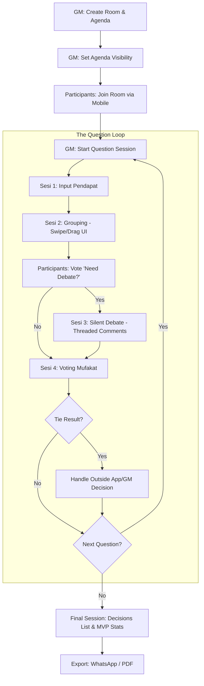

# VoxSilent: Product Specifications & Workflow

## 1. Core Features & Requirements

### 1.1 Room Management (GM Side - Laptop Recommended)
- **Room Creation & Setup:** GM menyusun agenda pertanyaan dan durasi.
- **Session Control & Skip Logic:** GM memegang kendali penuh dan memiliki opsi untuk melewati sesi.
- **Moderation Tools:** GM dapat menyembunyikan komentar (*Hide*) atau membisukan peserta (*Mute User*) secara anonim jika terjadi perilaku mengganggu.
- **Optimized Grouping UI:** Tampilan grouping menggunakan sistem **Swipe** (geser kanan/kiri) untuk memudahkan GM yang menggunakan HP, serta sistem *Drag & Drop* untuk laptop.
- **Meeting Playbooks (Templates):** Akses ke template rapat standar industri (misal: "Amazon Silent Meeting", "Google Sprint Review", "Daily Standup") agar GM tidak mulai dari nol.

### 1.2 Participant Interface (Mobile-First)
- **Agenda View:** Melihat daftar pertanyaan.
- **Debat Consent Vote:** Sebelum sesi debat dimulai, peserta melakukan voting cepat: *"Apakah topik ini perlu diperdebatkan?"*. Jika mayoritas memilih "Tidak", sesi debat akan otomatis dilewati (*skip*).
- **Anonymous Input & Debate:** Antarmuka mirip aplikasi chat untuk memberikan pendapat dan komentar.
- **Catch-up Mode:** Sinkronisasi otomatis bagi peserta yang sempat kehilangan koneksi internet agar tetap berada di sesi yang sama dengan peserta lain.

### 1.3 AI Intelligence (Business/Premium)
- **Automatic Clustering:** Menggunakan AI untuk mengelompokkan pendapat serupa secara otomatis.
- **Sentiment Analysis & Room Temperature:** AI mendeteksi "mood" atau sentimen kolektif peserta secara real-time (misal: 70% Setuju, 20% Ragu, 10% Khawatir).
- **Automatic MoM (Minutes of Meeting):** Di akhir rapat, AI merangkum hasil diskusi, alasan mufakat, dan daftar tugas (*Action Items*) secara otomatis.
- **Manual Refinement:** GM tetap memiliki kendali untuk memodifikasi hasil AI.

### 1.4 Silent Debate (Threaded Comments)
- **Anonymous Discussion:** Peserta dapat memberikan komentar, kritik, atau dukungan pada setiap ide/kelompok ide secara anonim.
- **Context Building:** Fitur ini bertujuan untuk memperdalam pertimbangan sebelum masuk ke tahap voting.
- **Support/Attack:** Memungkinkan debat sehat tanpa tekanan sosial.

### 1.5 Decision Logic (Elimination & Voting)
- **Elimination Phase:** Sesi di mana pendapat yang tidak relevan dibuang berdasarkan konsensus atau keputusan GM.
- **Voting Phase:** Peserta memberikan suara pada grup/pendapat yang paling disepakati berdasarkan hasil debat.

### 1.6 Dashboard, History & MVP
- **Meeting History:** Menampilkan ringkasan utama berupa **"Daftar Keputusan/Mufakat"** yang diambil, diikuti dengan data statistik.
- **MVP Participant (Best Contributor):** Penghargaan otomatis untuk peserta yang pendapatnya paling banyak dipilih atau mendapatkan dukungan tertinggi.

---

## 2. Master System Flowchart

